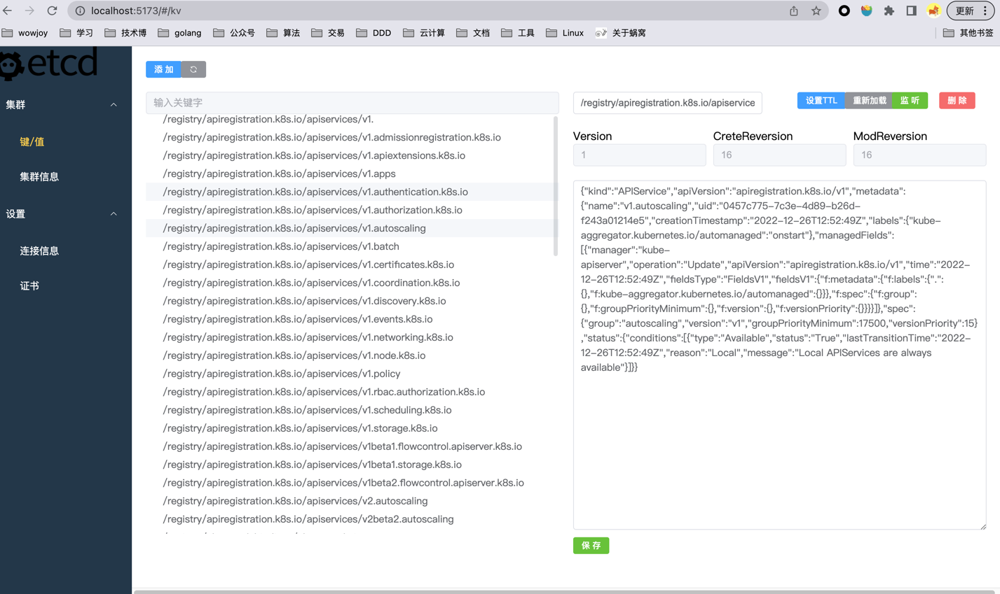
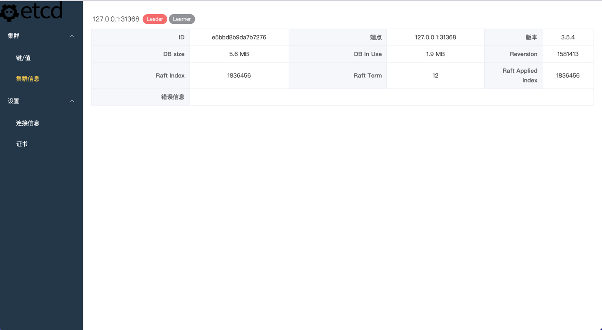
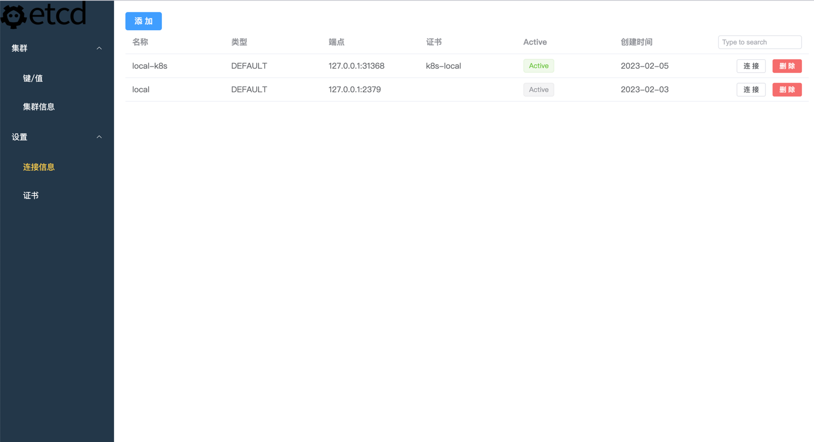
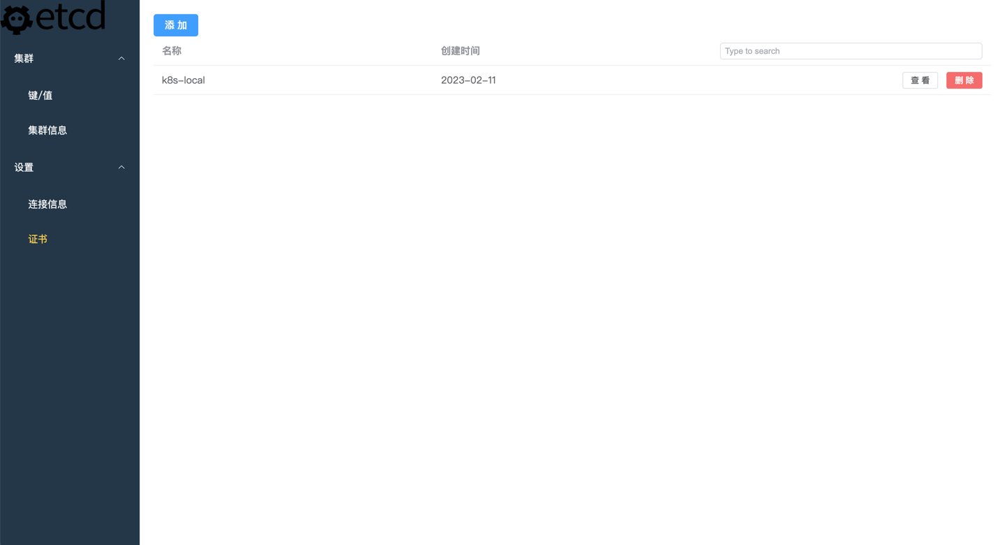

# etcd-ui


## etcd-docker-desktop 
```shell  
--cert-file=/run/config/pki/etcd/server.crt  
--key-file=/run/config/pki/etcd/server.key  
--trusted-ca-file=/run/config/pki/etcd/ca.crt
```
etcdctl --endpoints=https://127.0.0.1:31368 --cacert=./ca.crt --key=./peer.key --cert=./peer.crt get /registry/namespaces --prefix -w=json


## 首页










